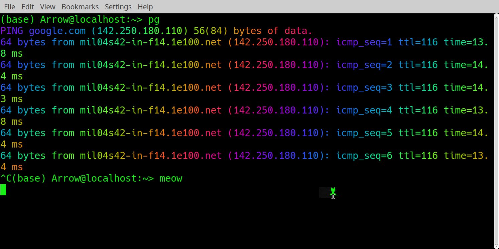

# Linux Terminal

The linux terminal window is where we are going to need to be to install python and python packages and maintain our directory structure and access and navigate on remote machines where we may be running our code as well as manage running processes on the machine.  This guide is fairly brief but will give you enough to start with.

## Basic Navigation

When you open a terminal window you will get a window with a command prompt and you will usually be in your home directory.  The first thing we need to do is find out where we are so we use `pwd` (<b>p</b>rint <b>w</b>orking **d**irectory):

```
$ pwd
```

This tells us where we are.  Next we need to move about so first we need to know where we could go with `ls` (<b>l</b>i<b>s</b>t) which tells us what is in the directory we are in:

```
$ ls
```

now including hidden files:

```
$ ls -a
```

in long format:

```
$ ls -l
```

The first 10 character part is the permissions (`drwxrwxrwx` would mean <b>d</b>irectory <b>r</b>ead <b>w</b>rite e<b>x</b>ecute at `user`, then `group`, then `other` level.  If a letter is replaced by "-" then permission is denied for that set of users) then owner, group, size, date last accessed, and filename.  

Permissions can be changed with `chmod` which works on the binary number so `chmod 644 file` makes file readable by anyone and writable by the owner only. This because `6` in binary is `110` which translates to `rw-` (`1` is on `0` off) for user and 4 in binary is `100` which translates to `r--` for everyone else so 644 is `-rw-r--r--`.  It also works in symbolic mode where the same command would be `chmod u=rw,go=r file` see `man chmod` for many other options. The `d` cannot be changed (it's either a directory or it's not and `chmod` can't do much about that).

Now in long format, by time, in reverse order, including hidden:

```
$ ls -ltra
```

The same but only for files called `hello.py`:

```
$ ls -ltra *.py
```

or all files ending in `.py`:

```
$ ls -ltra *.py
```

Here `*` is a wildcard in that it can match any number or characters (including none). 
Others are `?` which matches one character so `ma?` would match "mat", "map" and "man" but not "mast".  

`[]` matches any of the contents so `m[uao]m` matches "mum", "mam", "mom".  You can also use dash to indicate a range. So `[0-9]` matches any numeral and `[a-z]` matches any letter.  `!` negates the match so `[!9]` will match all but "9".

{} is a list of things, comma separated without spaces. 

Finally `\` is used to make special symbols literal so if you wanted to match `?` you would use `\?`

Also, options (bit after the dash) can be input in any order

To get a list of all possible options for a command you just need add `man` before it to consult the **man**ual pages.   Eg.:

The manual pages can be exited using `q`.

Now we need to navigate about which we can do using the `cd` (<b>c</b>hange <b>d</b>irectory) command:

```
$ cd some_directory
```

To get back one level:

```
$ cd ..
```

Or many levels:

```
$ cd ../../../../..
```

Or return to the home directory:

```
$ cd
```

This allows tab completion so `cd m<\tab>` would match all directories with `m*` and complete as much as is unique which is pretty helpful.  When changing directory to something like "My Documents" we need to treat the space as literal otherwise it thinks you've asked to change into two directories which doesn't make sense.  For this we can either use:

```
 cd "My Documents"
 cd My\ Documents
```

Next we might want to create or destroy files.  `touch` will create a blank file and `rm` (<b>r</b>e<b>m</b>ove) to delete it (`touch` also lets you edit the file's time-stamp which is helpful if you need to prove you were busy coding when the diamonds went missing).  For directories use `mkdir` and `rmdir`:

```
mkdir tmp
cd tmp
touch testfile.txt
cd ..
rm tmp/testfile.txt
rmdir tmp
```

These all accept wild cards so `rm *.out` removes all files ending in `.out`.  `rm` will also remove empty directories and with `-r` option (<b>r</b>ecursive) will delete the directory and everything in it.  You can also disable confirmation with `-f` (<b>f</b>orce).  Be \*VERY\* careful with this. `rm -rf *` will remove all files and directories from this directory up without confirmation.  This cannot be reversed.

We can make copies with `cp` (<b>c</b>o<b>p</b>y):

```
touch a.txt
cp a.txt b.txt
ls -ltr *.txt
```

or just move them with `mv` (<b>m</b>o<b>v</b>e):

```
mv b.txt c.txt
ls -ltr *.txt
```

`mv` is best for changing the file's directory or renaming files.  To rename multiple files there sometimes is the command `rename` (it's not on all distributions, which is a shame as it's handy.  Check with `man rename`) which has the form

`rename 'old string' 'new string' 'pattern to match files'`

So to change all our `*.txt` files to `*_old.txt`:

```
rename .txt _old.txt *.txt
ls -ltr *.txt
```

Finally when we need to find things we can use `find` to locate files in a directory tree:

```
find . -name "*.txt"
```

(just `find *.txt` appears to work but is really expanding `*.txt` to match all files in the current directory then finding each in turn so won't go down directory trees)

And `grep` to find text in a file (the -E just means <b>E</b>xtended which means it can use regular expressions with wildcards):

```
touch d.txt
echo "hello world" > d.txt
grep -E 'hello' *.txt
```

where `echo` just prints whatever is in the quotes.

Lastly to simply read a file to see what is in it we can use `cat`, `more` or `less`:

```
cat d.txt
more d.txt
less d.txt
```

`cat` is only good for small files as it reads all of them at once but it can also con<b>cat</b>enate files (join them together).  `less` and `more` both just do a page at a time and have a lot of options with `-n` for line numbers being the most useful.  `tail` lets you read from the bottom of a file instead of the top and `tail -f` (<b>f</b>ollow) is useful for tracking output to files your code is writing to without locking them (which can cause code to crash.)


Note that if you want to "scroll up" in the terminal to see the previous commands output, you (usually) need to hold the shift key while pressing the up/down arrows, otherwise you will only see the history of the commands. As for the history itself, you can "reverse search" it by pressing `CTRL+R` and typing the part of the command you remember.  

### Exercise

1. Make a directory called tmp and change into it
2. Create a file test.txt
3. copy it to test2.txt then rename test.txt to test1.txt
4. delete the files, then delete the directory

## Redirection

We can redirect output from one command to a file or the contents of a file to a command using `>` and `<` 

```
$ ls -l > output.txt
```

Will list our directory and write it to a file called `output.txt`, which it will create it if it does not exist (so `> somefile.txt` works the same as `touch somefile.txt`).

```
$ grep hello < some_file.txt
```

will search for `hello` in the file `some_file.txt` (you can do this without the `<` and it will still work fine). We can also pipe the output of one command to another:

```
ls -l | grep Jan > e.txt
```

Will list all files in our directory last edited in January and put them in a file called e.txt.

There are some extensions to this:
- `>>` appends to the end of a file
- `1>` redirects stdout
- `2>` redirects stderr so only the errors
- `&>` redirects both stdout and stderr

You can also redirect to `/dev/null` which is a black hole.

One of the handy commands with redirection to remember is searching the history when the reverse search would take too long to cycle through:

```
$ history|grep "cd"
```


### Exercise

5. Go into the directory `pycamb` then write a single line command that finds all `.py` files and count how any lines contain `if`
6. Guess the meaning of the following:

```
ls i_do_not_exist *.txt 2> /dev/null | grep [de]
ls i_do_not_exist *.txt 2>&1 | grep [de]
ls i_do_not_exist *.txt 2>&1 1>/dev/null | grep [de]
ls i_do_not_exist *.txt 1>/dev/null 2>&1 | grep [de]
```

## Mangaging processes

List all processes you control:

```
$ ps
```

List all processes on the system with all info:

```
$ ps -elf
```

We can also open an interactive live picture:

```
top
```

This has many options with some of the more useful being `-o` which sorts it by any column but `mem`, `user`, `time` and `cpu` (default) are useful and `-user me123` to display only one user.  These options can be on the command line or while in the top window itself

When you start processes you can do so in the background with `jobscript &` then check them with the command `jobs`. Then `bg` sends the job to the background and `fg` sends it to the foreground.

```
jobs -l
sleep 30 &
sleep 20 &
sleep 10 &
jobs -l
fg 3
```

In order to change the status of the jobs you can use the `kill` command:

```
jobs -l
sleep 300 &
sleep 200 &
sleep 100 &
kill -SIGSTOP %1
kill -SIGTERM %2
kill -SIGKILL %3
jobs -l
kill -SIGCONT %1
jobs -l
kill -SIGTERM %1
```

The option `-SIGSTOP` means pause the job, `-SIGCONT` restarts it (in the background so this is equivalent to `bg`, you can change it to the foreground, if that's were it was, this with `fg`).  `-SIGTERM` attempts a clean exit so is good for applications (as they get a change to save your data etc..). `-SIGKILL` kills the process no matter what.  These all have numeric shorthands `-9` for `-SIGKILL`, `-15` for `-SIGTERM`.   The other two are system dependent so one of `-17`,`-19`,`-23` for `-SIGSTOP` and `-19`,`-18`,`-25` for `-SIGCONT`.

### Exercise

7. Try the above line by line to see what happens

## Remote Computing

Once you start writing larger codes that exceed the local resources of you computer or laptop you will have to start working on dedicated machines which you will likely have to access remotely.  This is done with the command `ssh` (<b>s</b>ecure <b>sh</b>ell).

```
$ ssh username@machinename
```

This can be tested for DAMTP and DPMMS users with the command below:

```
$ ssh -X CRSid@ssh.maths.cam.ac.uk
```

This just makes your terminal window act like one on the remote machine.  The `-X` allows 'X forwarding' so can transfer GUI interfaces between the computers.  To edit files remotely you have to use the standard editors on the machine you have `ssh`ed to, usually `vim` or `emacs`. Both are powerful and have dedicated fans but the learning curve is very steep. You should google tutorials if you want to learn more, there are loads for both of them.  

You can copy the files between the machines with `scp` (<b>s</b>ecure <b>c</b>o<b>p</b>y) or `sftp` (<b>s</b>ecure <b>f</b>ile <b>t</b>ransfer <b>p</b>rotocol).  First `scp` works just like `cp`:

```
scp username@machinename:file.txt /local/directory/.
scp -r username@machinename:/remote/directory /local/directory/
```

`sftp` is a bit different.  Here you login to the remote machine and open an `ftp` window where you move files with `get` and `put`:

```
sftp  username@machinename

get remotefile
put localfile

get remotefile copytonewlocalname
```

Personally I don't like `vim` or `emacs` as I can't remember the dozens of commands you need to make them work and I find coping the files back and forth is too annoying so I use a `ssh` client like Cyberduck for mac, WinSCP for windows or on Linux you can use Dolphin or Nautilus.  These make the remote directory look like a local one and you can open files with your favorite editor (which makes a local copy), edit them, then save (which should copy the file back, at least for Cyberduck) which makes working on remote code easy.

However, I should note that it's not always possible to connect like that, for example if you need to ssh a few times to get to your code. For those situations, one still needs to know at least the very basics of `vim` which is a default text editor on most linux machines. To launch it, you need to type `vim FILENAME`. This will allow you to view the file. To edit it, you need to enter the edit mode by typing `i` (from "insert"). After editing, press the escape key. To close the file, you need to type `:q` to exit if you didn't edit anything, `:q!` if you edited and want to discard the changes or `:wq` if you want to save them.

### Exercise

8. Try to ssh into the maths computers with CRSid@ssh.maths.cam.ac.uk
9. Make a file with in you local directory then log out (`exit`)
10. Copy the file from your home directory back to here.

## Enviroment

When you log in, `bash` will execute several *script* files; basically lists of commands
-   system startup files
-   personal ones in `~/.bash_profile` (login sessions) or `~/.bashrc` (other sessions)
-   edit as you see fit, but be careful: mistakes can lead to inability to log in!

*Environment variables* control how `bash` behaves; most important one is `PATH` list of colon-separated directory names to look, in order, for commands typed in the prompt:

```
$ echo ${PATH}
```

To see all environment variables use `env`:

```
$ env
```

Editing `~/.bashrc` or `~/.bash_profile` is only sensible for things that you need to set up every time you login to a system.  A good example is to load modules your code needs or to set up shortcuts.

As an example here is mine for the cosmos supercomputer:

```
# ~/.bashrc.local
# $Id: .bashrc.local,v 1.4 2009/01/26 11:00:13 root Exp $
# $Source: /home/cosmos/template/RCS/.bashrc.local,v $
#
# Add/modify here your custom environment settings

alias cosmos2='msub -q debug2 -I -V -l nodes=1:ppn=1,mem=50gb,walltime=08:00:00 -N debug_session'

module load icomp mpt gsl cfitsio pgplot healpix/3.40-serial-intel-15.0
module load cosmolib python
```

This sets up the shortcut using the `alias` command so when I type `cosmos2` it executes the command in red which launches an interactive job in the debugging queue.  Then I load a bunch of modules I need to run my code on the machines. 

You probably shouldn't load modules this way unless you are sure you will always need them and will not forget they are there.

## Scripting

You should also note that all the commands here can be executed as a script (just a file with a list of commands.  It is often given the extension `.sh` as in `somthing.sh`.  `sh` is an earlier version of `bash` so this is actually a bit misleading.  It's not a requirement so you can do whatever you want but it's nice to have something that tells you what it does in the name).  

First you need to start the file with:

`#!/bin/bash`

This isn't strictly necessary but makes sure your computer knows to interpret the following commands using the `bash` language (what the terminal is using for its `kernel` if any of the above worked.  `kernel` just means 'thing which interprets the commands you type') and after this you can just list commands that you want.  This can fail if `bash` isn't in the `/bin` directory.  Instead you might need:

`#!/usr/local/bin/bash` --  Another place bash sometimes lives

`#!/usr/bin/env bash`    Works if `bash` is in your path

You can in fact put any kernel here for any other scripting language, like for example:

`#!/bin/python`

Back to bash, once you have this line you can write commands just like you were entering them into the terminal.  So an example might be:

```
cd ~code/output
rm -f *.log *.out
```

You would then save this into a file `cleanup.sh`. Then you have to change the file permissions to allow execution ie: `chmod 744 cleanup.sh`.  Then you can run it on the command line with

`./cleanup.sh`
or
`bash cleanup.sh`

This can be helpful for sets of commands you often run together.

BASH is actually a fairly powerful programming language on its own.  You have variables:

```
var1=1
echo "var1 = $var1"

str1="Hello"
echo "str1 = $str1"
```

Note the double quotes, single quotes will result in `echo` not expanding the variable by printing the name instead.  Also you can't have any spaces in assignment so `var1 = 1` fails.

It also has loops:

```
for i in {1..10}; # {1..10} expands to "1 2 3 4 5 6 7 8 9 10"
do 
    echo "List form:    The iteration number is $i"
done

for (( i = 0; i < 10; i++ )) #C style loop
do
    echo "C style form: The iteration number is $i"
done

i=0
while [ $i -lt 5 ] #Executes until false
do
    echo "while: i is currently $i"
    i=$[$i+1] #Not the lack of spaces around the brackets. This makes it a not a test expression
done

i=5
until [[ $i -eq 10 ]]; #Executes until true
do
    echo "until: i is currently $i"
    i=$((i+1))
done
```

and conditional expressions:

```
if [ "$num" -eq 1 ]; then
    echo "the number is 1"
elif [ "$num" -gt 2 ]; then
    echo "the number is greater than 2"
else
    echo "The number was not 1 and is not more than 2."
fi
```

here `-lt`, `-gt`, `-eq` means "less than", "greater than" and "equal to" respectively.  We don't really have time to go over `bash` properly and anyway it would be best to do so after learning python to get you used to coding first as `bash` isn't always all that clear.  I will just mention one thing which might be useful which is `bash` has `&&` meaning "and" and`||` meaning "or" which help for error trapping.  For the first example `cleanup.sh` we should really have done this:

```
cd ~code/output || exit
rm -f *.log *.out
```

Now the script will exit if it can't change into the directory.  Before, if this line failed it would then have just deleted stuff wherever you were which is a bit dangerous.

All of the above code is in the file `test1` in the directory `Bash` if you want to test it out.

Finally, it's worth mentioning a good tool for processing text files often used in bash script (for those who don't like python) - `AWK`. It is like its a minor language, so we won't go into details of using it, but you should know about its existence should the need arise to write a text processing script which can't be easily done in pure standard bash. 

NOTE: editing `bash` scripts on windows adds different new line characters and the code will fail.  This can be fixed with things like the programme `dos2unix`.

This should be enough to get you started but there is plenty more.  Here are the notes on the university information service course on the unix terminal:
https://help.uis.cam.ac.uk/service/help-support/training/downloads/course-files/programming-student-files/unix-cli/unix-cli-files/working-copy-unixcli.pdf.

For `bash` scripting here is a link to a free 100 page book which is worth a skim for people who want to know more: https://books.goalkicker.com/BashBook/.  

Or consult the manual:
https://www.gnu.org/savannah-checkouts/gnu/bash/manual/bash.html

Finally here is a list of all commands available in `bash`
https://courses.cs.washington.edu/courses/cse391/17sp/bash.html

Otherwise, as always in coding, google is your friend.

## Some fun


Linux console doesn't have to be all boring, for example, by installing `lolcat` and `oneko` packages and making aliases in the `.bashrc` like

```
alias pg='ping google.com|lolcat.ruby2.5 -F 0.3'
alias meow='oneko -bg green'
```

you can get the following colorful ping output and a little cat chasing your cursor:


