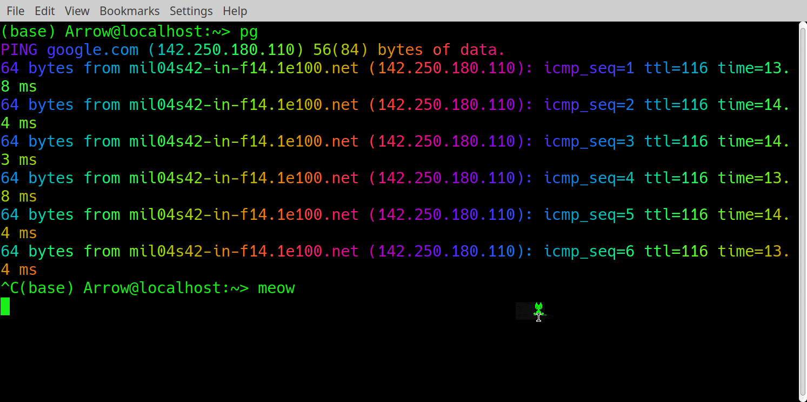

# Linux Terminal

The Linux terminal is primarily useful for managing the running of your code, either locally or on remote computing resources.  In this lesson we will cover how to submit and manage jobs from the command line and how to control our computing enviroment.

## Mangaging processes

To submit a job on the command line you just need to pass your script to an interpreter, just like we were foiong for `sed` and `awk`.  Here we used the command structure:

```
sed -f command_file.sed < quote.txt
```

Here we specify the **interpreter** to read the code, which is contained in "command_file.sed" and convert it to instructions for the computer to carry out.  Here we use `< quote.txt` to pass in input and we could record the output to a file using `> output.txt`.  This is what we are doing in out terminal but here we don't need to specify the interpreter as it defaults to `bash`

Often your code could run for a while, and you don't want to have to leave the terminal hanging, so you can specify for the code to run in the **background** by appending `&` at the end.  For example:
```
sleep 10 &
```
This will create a job that `sleeps` (does nothing) for 10 seconds then returns,  Adding the `&` makes it return immediatly and the process runs in the background instead.  When you do this you are given the message:
```
$ sleep 10 &
[1] 84144
```
Where the `[1]` is the "job id" (or jobID) and `84144` is the process identification number (or PID) 
  Now that your processes are running in the background you need to know when they are complete


List all processes you control:

```
$ ps
```

List all processes on the system with all info:

```
$ ps -elf
```

We can also open an interactive live picture:

```
top
```

This has many options with some of the more useful being `-o` which sorts it by any column but `mem`, `user`, `time` and `cpu` (default) are useful and `-user me123` to display only one user.  These options can be on the command line or while in the top window itself

When you start processes you can do so in the background with `jobscript &` then check them with the command `jobs`. Then `bg` sends the job to the background and `fg` sends it to the foreground.

```
jobs -l
sleep 30 &
sleep 20 &
sleep 10 &
jobs -l
fg 3
```

In order to change the status of the jobs you can use the `kill` command:

```
jobs -l
sleep 300 &
sleep 200 &
sleep 100 &
kill -SIGSTOP %1
kill -SIGTERM %2
kill -SIGKILL %3
jobs -l
kill -SIGCONT %1
jobs -l
kill -SIGTERM %1
```

The option `-SIGSTOP` means pause the job, `-SIGCONT` restarts it (in the background so this is equivalent to `bg`, you can change it to the foreground, if that's were it was, this with `fg`).  `-SIGTERM` attempts a clean exit so is good for applications (as they get a change to save your data etc..). `-SIGKILL` kills the process no matter what.  These all have numeric shorthands `-9` for `-SIGKILL`, `-15` for `-SIGTERM`.   The other two are system dependent so one of `-17`,`-19`,`-23` for `-SIGSTOP` and `-19`,`-18`,`-25` for `-SIGCONT`.

### Exercise

7. Try the above line by line to see what happens

## Remote Computing

Once you start writing larger codes that exceed the local resources of you computer or laptop you will have to start working on dedicated machines which you will likely have to access remotely.  This is done with the command `ssh` (<b>s</b>ecure <b>sh</b>ell).

```
$ ssh username@machinename
```

This can be tested for DAMTP and DPMMS users with the command below:

```
$ ssh -X CRSid@ssh.maths.cam.ac.uk
```

This just makes your terminal window act like one on the remote machine.  The `-X` allows 'X forwarding' so can transfer GUI interfaces between the computers.  To edit files remotely you have to use the standard editors on the machine you have `ssh`ed to, usually `vim` or `emacs`. Both are powerful and have dedicated fans but the learning curve is very steep. You should google tutorials if you want to learn more, there are loads for both of them.  

You can copy the files between the machines with `scp` (<b>s</b>ecure <b>c</b>o<b>p</b>y) or `sftp` (<b>s</b>ecure <b>f</b>ile <b>t</b>ransfer <b>p</b>rotocol).  First `scp` works just like `cp`:

```
scp username@machinename:file.txt /local/directory/.
scp -r username@machinename:/remote/directory /local/directory/
```

`sftp` is a bit different.  Here you login to the remote machine and open an `ftp` window where you move files with `get` and `put`:

```
sftp  username@machinename

get remotefile
put localfile

get remotefile copytonewlocalname
```

Personally I don't like `vim` or `emacs` as I can't remember the dozens of commands you need to make them work and I find coping the files back and forth is too annoying so I use a `ssh` client like Cyberduck for mac, WinSCP for windows or on Linux you can use Dolphin or Nautilus.  These make the remote directory look like a local one and you can open files with your favorite editor (which makes a local copy), edit them, then save (which should copy the file back, at least for Cyberduck) which makes working on remote code easy.

However, I should note that it's not always possible to connect like that, for example if you need to ssh a few times to get to your code. For those situations, one still needs to know at least the very basics of `vim` which is a default text editor on most Linux machines. To launch it, you need to type `vim FILENAME`. This will allow you to view the file. To edit it, you need to enter the edit mode by typing `i` (from "insert"). After editing, press the escape key. To close the file, you need to type `:q` to exit if you didn't edit anything, `:q!` if you edited and want to discard the changes or `:wq` if you want to save them.


## Scripting


## vim

### Exercise

8. Try to ssh into the maths computers with CRSid@ssh.maths.cam.ac.uk
9. Make a file with in you local directory then log out (`exit`)
10. Copy the file from your home directory back to here.

## Enviroment

When you log in, `bash` will execute several *script* files; basically lists of commands
-   system startup files
-   personal ones in `~/.bash_profile` (login sessions) or `~/.bashrc` (other sessions)
-   edit as you see fit, but be careful: mistakes can lead to inability to log in!

*Environment variables* control how `bash` behaves; most important one is `PATH` list of colon-separated directory names to look, in order, for commands typed in the prompt:

```
$ echo ${PATH}
```

To see all environment variables use `env`:

```
$ env
```

Editing `~/.bashrc` or `~/.bash_profile` is only sensible for things that you need to set up every time you login to a system.  A good example is to load modules your code needs or to set up shortcuts.

As an example here is mine for the cosmos supercomputer:

```
# ~/.bashrc.local
# $Id: .bashrc.local,v 1.4 2009/01/26 11:00:13 root Exp $
# $Source: /home/cosmos/template/RCS/.bashrc.local,v $
#
# Add/modify here your custom environment settings

alias cosmos2='msub -q debug2 -I -V -l nodes=1:ppn=1,mem=50gb,walltime=08:00:00 -N debug_session'

module load icomp mpt gsl cfitsio pgplot healpix/3.40-serial-intel-15.0
module load cosmolib python
```

This sets up the shortcut using the `alias` command so when I type `cosmos2` it executes the command in red which launches an interactive job in the debugging queue.  Then I load a bunch of modules I need to run my code on the machines. 

You probably shouldn't load modules this way unless you are sure you will always need them and will not forget they are there.

## Scripting

You should also note that all the commands here can be executed as a script (just a file with a list of commands.  It is often given the extension `.sh` as in `somthing.sh`.  `sh` is an earlier version of `bash` so this is actually a bit misleading.  It's not a requirement so you can do whatever you want but it's nice to have something that tells you what it does in the name).  

First you need to start the file with:

`#!/bin/bash`

This isn't strictly necessary but makes sure your computer knows to interpret the following commands using the `bash` language (what the terminal is using for its `kernel` if any of the above worked.  `kernel` just means 'thing which interprets the commands you type') and after this you can just list commands that you want.  This can fail if `bash` isn't in the `/bin` directory.  Instead you might need:

`#!/usr/local/bin/bash` --  Another place bash sometimes lives

`#!/usr/bin/env bash`    Works if `bash` is in your path

You can in fact put any kernel here for any other scripting language, like for example:

`#!/bin/python`

Back to bash, once you have this line you can write commands just like you were entering them into the terminal.  So an example might be:

```
cd ~code/output
rm -f *.log *.out
```

You would then save this into a file `cleanup.sh`. Then you have to change the file permissions to allow execution ie: `chmod 744 cleanup.sh`.  Then you can run it on the command line with

`./cleanup.sh`
or
`bash cleanup.sh`

This can be helpful for sets of commands you often run together.

BASH is actually a fairly powerful programming language on its own.  You have variables:

```
var1=1
echo "var1 = $var1"

str1="Hello"
echo "str1 = $str1"
```

Note the double quotes, single quotes will result in `echo` not expanding the variable by printing the name instead.  Also you can't have any spaces in assignment so `var1 = 1` fails.

It also has loops:

```
for i in {1..10}; # {1..10} expands to "1 2 3 4 5 6 7 8 9 10"
do 
    echo "List form:    The iteration number is $i"
done

for (( i = 0; i < 10; i++ )) #C style loop
do
    echo "C style form: The iteration number is $i"
done

i=0
while [ $i -lt 5 ] #Executes until false
do
    echo "while: i is currently $i"
    i=$[$i+1] #Not the lack of spaces around the brackets. This makes it a not a test expression
done

i=5
until [[ $i -eq 10 ]]; #Executes until true
do
    echo "until: i is currently $i"
    i=$((i+1))
done
```

and conditional expressions:

```
if [ "$num" -eq 1 ]; then
    echo "the number is 1"
elif [ "$num" -gt 2 ]; then
    echo "the number is greater than 2"
else
    echo "The number was not 1 and is not more than 2."
fi
```

here `-lt`, `-gt`, `-eq` means "less than", "greater than" and "equal to" respectively.  We don't really have time to go over `bash` properly and anyway it would be best to do so after learning python to get you used to coding first as `bash` isn't always all that clear.  I will just mention one thing which might be useful which is `bash` has `&&` meaning "and" and`||` meaning "or" which help for error trapping.  For the first example `cleanup.sh` we should really have done this:

```
cd ~code/output || exit
rm -f *.log *.out
```

Now the script will exit if it can't change into the directory.  Before, if this line failed it would then have just deleted stuff wherever you were which is a bit dangerous.

All of the above code is in the file `test1` in the directory `Bash` if you want to test it out.

Finally, it's worth mentioning a good tool for processing text files often used in bash script (for those who don't like python) - `AWK`. It is like its a minor language, so we won't go into details of using it, but you should know about its existence should the need arise to write a text processing script which can't be easily done in pure standard bash. 

NOTE: editing `bash` scripts on windows adds different new line characters and the code will fail.  This can be fixed with things like the programme `dos2unix`.

This should be enough to get you started but there is plenty more.  Here are the notes on the university information service course on the unix terminal:
https://help.uis.cam.ac.uk/service/help-support/training/downloads/course-files/programming-student-files/unix-cli/unix-cli-files/working-copy-unixcli.pdf.

For `bash` scripting here is a link to a free 100 page book which is worth a skim for people who want to know more: https://books.goalkicker.com/BashBook/.  

Or consult the manual:
https://www.gnu.org/savannah-checkouts/gnu/bash/manual/bash.html

Finally here is a list of all commands available in `bash`
https://courses.cs.washington.edu/courses/cse391/17sp/bash.html

Otherwise, as always in coding, google is your friend.

## Some fun


Linux console doesn't have to be all boring, for example, by installing `lolcat` and `oneko` packages and making aliases in the `.bashrc` like

```
alias pg='ping google.com|lolcat.ruby2.5 -F 0.3'
alias meow='oneko -bg green'
```

you can get the following colorful ping output and a little cat chasing your cursor:


